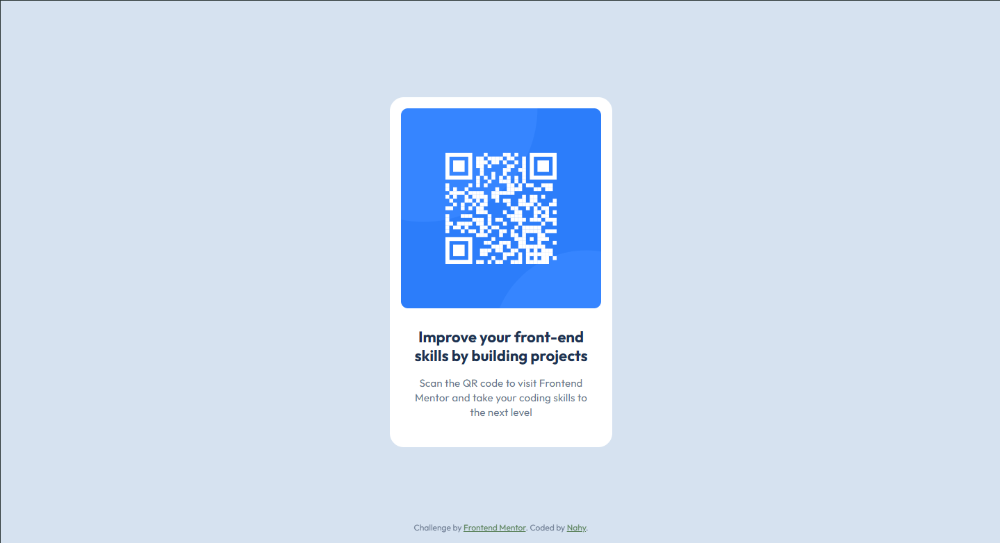

# Frontend Mentor - QR code component solution

This is a solution to the [QR code component challenge on Frontend Mentor](https://www.frontendmentor.io/challenges/qr-code-component-iux_sIO_H).

## Table of contents

- [Overview](#overview)
  - [Screenshot](#screenshot)
  - [Links](#links)
- [Built with](#built-with)
- [Author](#author)

## Overview

### Screenshot

#### Design - Desktop

#### Screenshot - Desktop

#### Design - Mobile

#### Screenshot - Mobile

### Links

- Solution URL: [Solution Repository](https://github.com/nah-y/fm_qr_code_component)
- Live Site URL: [Live Site](https://nahys-qr-code-component.netlify.app/)

## Built with

- Semantic HTML5 markup
- CSS custom properties
- Flexbox

## Author

- Website - [nahy]()
- Frontend Mentor - [@nah-y](https://www.frontendmentor.io/profile/nah-y)
